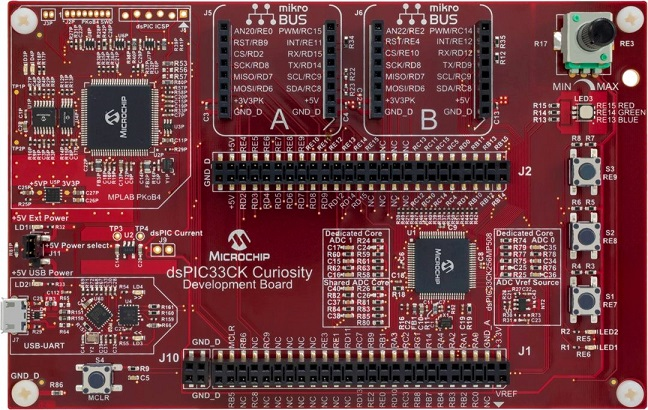
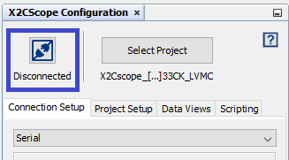

# MPLAB X Project: X2Cscope_blinky_dsPIC33CK_CURIO_customHAL

This is a X2Cscope demo project for [dsPIC33CK Curiosity Development Board](https://www.microchip.com/developmenttools/ProductDetails/PartNO/DM330030) development board and [dsPIC33CK256MP508](https://www.microchip.com/wwwproducts/en/dsPIC33CK256MP508) microcontroller that is populated on the board.

The purpose is to demonstrate how to integrate X2Cscope to a custom/bare application.

* X2Cscope documentation: [https://x2cscope.github.io/](https://x2cscope.github.io/)
* X2Cscope training: [Microchip University](https://mu.microchip.com/page/all-courses)

The code functionality is minimalistic in order to avoid unneceseary confusion. The firmware generates a digital sawtooth and a sine signal. There is LED1 that is blinking with the sawtooth signal's period. The LED2 can be controlled manually by the [X2Cscope run-time debugger tool](https://x2cscope.github.io/). The state of the SW1 can be read out by X2Cscope.

## Getting Started

The demo is ready to use with the [listed hardwares below](#hardware).

1. Clone or Download zipped project.
2. [Connect Hardware](#connectors-used).
3. Open project with MPLAB X
4. Build project
5. Program the Hardware (HW) with the PICkit on board
6. Verify LED1 is blinking

## Use X2Cscope

The X2Cscope tool uses the UART to transfer data from and to the HW. To use this feature follow the steps:

1. Verify if X2Cscope plug-in is installed within MPLAB X. Detailed user guide: https://x2cscope.github.io/
2. Open X2Cscope 

3. Verify UART settings at the Connection Setup tab and also check the COM port number on the PC. (device manager)

4. Connect to the HW with clicking on the connect sign:

6. Use the Watch and Scope data views (available on the Data Views tab).

## Hardware

* **dsPIC33CK Curiosity:** [DM330030](https://www.microchip.com/developmenttools/ProductDetails/PartNO/DM330030) Curiosity Development Board with [dsPIC33CK256MP508] (https://www.microchip.com/wwwproducts/en/dsPIC33CK256MP508) MCU populated on board

### Connectors used:

* **J7 USB:** PICkit on board 4 (PKOB4) programmer debugger with integrated USB-UART converter

### Configuration

Curiosity board is used in the default configuration. 

The the curiosity board is capable to configure different communication routing modes by zero Ohm jumper resistors. For details use the board GUIDE.

## Peripheral settings and I/O connections: 

**UART:**
   * Baud rate: 115200
   * Parity: None
   * Data bits: 8
   * Stop bits: 1
   * Flow control: no

**TIMER1:**
   * 1ms period
   * interrupt enabled

**IO**

| J2  | PIN | PORT   | Function |
| --- | ----|--------|----------|
|  41 |  68 | RD4/RP68   | UART1 TX |
|  43 |  69 | RD3/RP67   | UART1 RX |
|  42 |  37 | RE6    | IO_LED1  |
|  44 |  24 | RE5    | IO_LED2  |
|  40 |  39 | RE7    | IO_SW1   |
|  38 |  42 | RE8    | IO_SW2   |

   Peripherals are configured manually in the HAL.c and X2Cscope.c files.

## Software

To use the demo only the MPLAB X IDE and XC16 compiler is required. 

* [MPLAB X](https://www.microchip.com/mplab/mplab-x-ide) Integrated Development Environment. 
* [XC16 Compiler:](https://www.microchip.com/mplab/compilers) Compiler for the Microchip 16bit MCUs
## Built With

* [XC16 v1.60](https://www.microchip.com/mplab/compilers) - Microchip C compiler for 16bit micros
low levev drivers
* [X2Cscope v0.6](https://x2cscope.github.io/) - Run-time firmware based debugger tool
